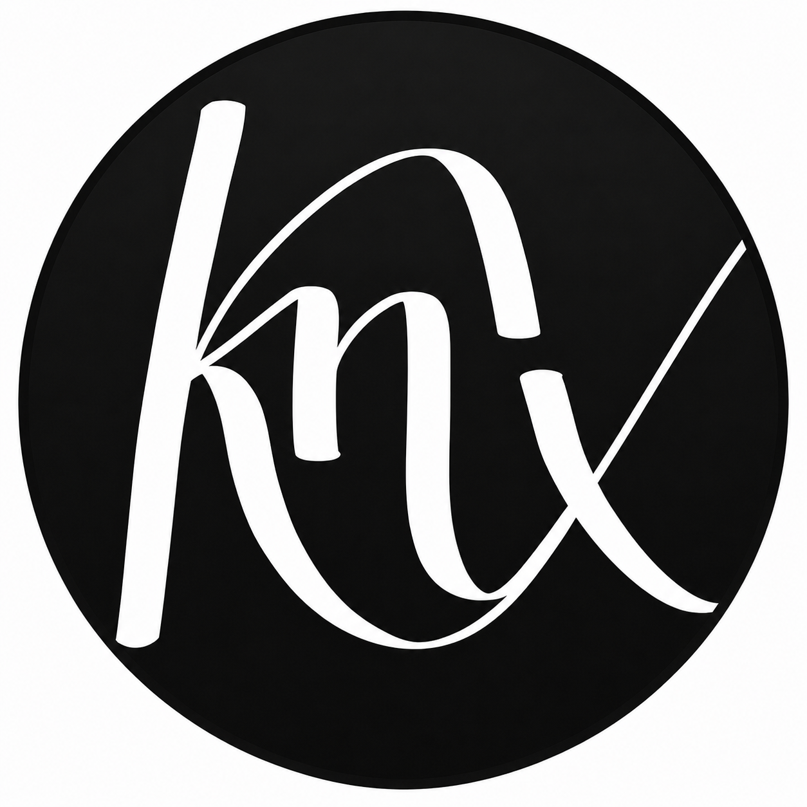

# KRONNEX &middot; Independent Conversion Studio



An independent conversion studio engineering social creatives, luxury real-estate portfolios, clinical content pipelines, and automated prospecting engines. We gauge every customer partnership in calls, leads, and conversion metrics — not placeholder content calendars or vanity metrics.

## 🚀 Quick Start

**Prerequisites:**  Node.js (v18+)

1. Install dependencies:
   ```bash
   npm install
   ```
2. Run the development server:
   ```bash
   npm run dev
   ```
3. Open `http://localhost:3000` in your browser to view the application.

## 🛠️ Built With
- React
- Vite
- Tailwind CSS
- Lucide React
- Framer Motion

## 📜 Credits & Licensing

**Built by** [TEAM o7 Digital solutions](https://team-o7-digital-solutions.vercel.app/)  
**Creator Credits:** [BALAVIGNESHWARTG](https://github.com/BALAVIGNESHWARTG)

---
&copy; 2026 Image Innovation Technology Pvt. Ltd. All rights reserved.
